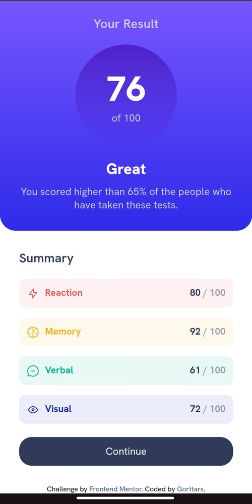

# Desafio Frontend Mentor - Results Summary Component

Este é o meu projeto para o desafio "Results Summary Component" do site [Frontend Mentor](https://www.frontendmentor.io/challenges/results-summary-component-CE_K6s0maV). O desafio consistia em criar um componente de resumo de resultados responsivo para desktop e mobile.

## Visão Geral

O projeto consiste em um componente de resumo de resultados com foco na responsividade para diferentes dispositivos. Utilizei HTML e CSS para construir o componente, garantindo uma experiência de usuário consistente em desktop e mobile.

## Screenshots

### Desktop

### Mobile

## Tecnologias Utilizadas

- HTML
- CSS

